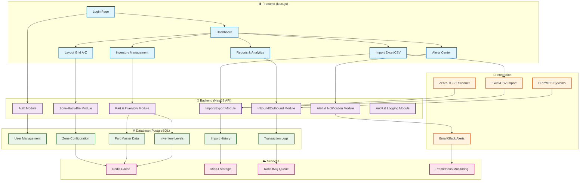
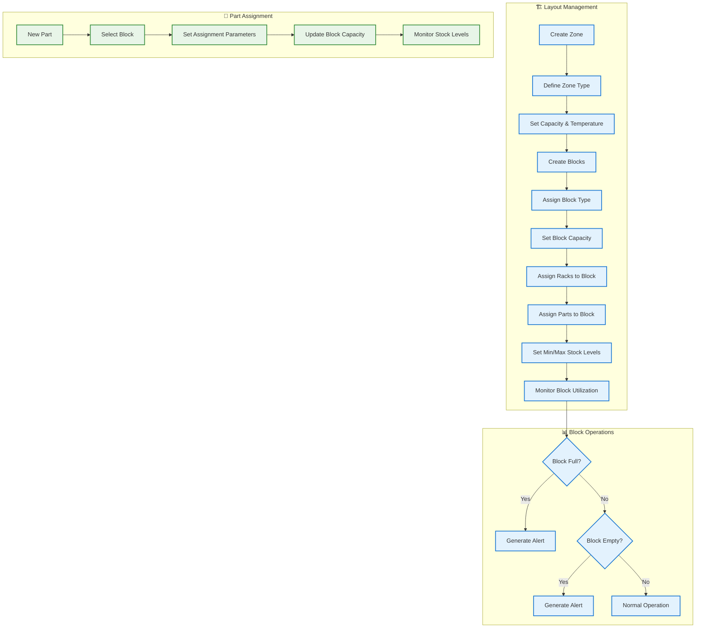
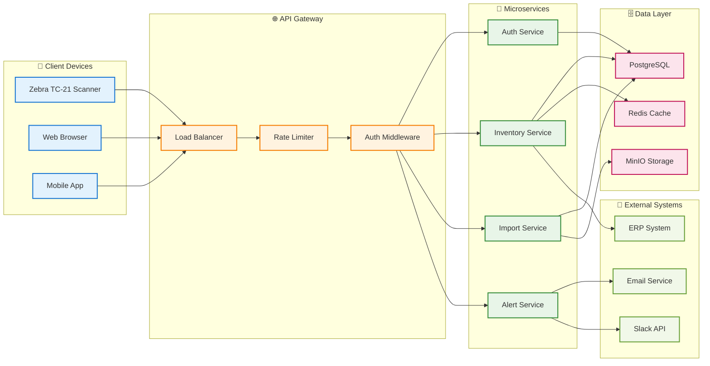

# WMS - Smart Factory Full Lifecycle (General Edition)

A comprehensive Warehouse Management System for large industrial factories, featuring barcode scanning via Zebra TC-21, Min-Max alerts, Excel import/export, and real-time analytics.

## 🏭 Core Features

- **Import Part List**: Drag-to-map header UI with row-hash deduplication
- **Layout Management**: Zone-Rack-Block visualization (A-Z × vrow 01-99 × hrow 01-10)
- **Block-Based Zones**: Create custom blocks with part assignments and capacity management
- **Inbound/Outbound**: LocalKanbanID ↔ StoreAddress ↔ CustomerPartNo validation
- **Dashboard & Alerts**: Min/Max threshold notifications with import/export history
- **Multi-language**: Thai/English interface with i18n support
- **Enterprise Security**: JWT authentication, RBAC, audit logging

## 🛠️ Technology Stack

**Backend**: NestJS + TypeScript + PostgreSQL (Prisma ORM)  
**Frontend**: Next.js + Tailwind + shadcn/ui + i18n (EN/TH)  
**Cache**: Redis  
**Storage**: MinIO (file uploads and templates)  
**Message Bus**: RabbitMQ (Event-driven)  
**Deployment**: Docker Compose / Kubernetes

## 📁 Project Structure

```
wms-monorepo/
├─ apps/
│  ├─ backend/       # NestJS + Prisma API
│  └─ frontend/      # Next.js + Tailwind + shadcn/ui
├─ packages/
│  ├─ postman/       # API collections
│  └─ shared/        # utility / i18n / config
├─ docker-compose.yml
├─ factory.config.json
├─ .github/workflows/ci.yml
└─ README.md
```

## 🚀 Quick Start

1. **Clone and setup**:
   ```bash
   git clone <repository>
   cd wms-monorepo
   ```

2. **Start services**:
   ```bash
   docker-compose up -d
   ```

   The compose stack will boot PostgreSQL, Redis, MinIO, RabbitMQ, the NestJS API, the Next.js UI, and the monitoring toolset
   (Prometheus + Grafana).

3. **Install dependencies**:
   ```bash
   cd apps/backend && npm install
   cd ../frontend && npm install
   ```

4. **Run migrations**:
   ```bash
   cd apps/backend && npx prisma migrate deploy
   ```

5. **Start development**:
   ```bash
   # Backend
   cd apps/backend && npm run start:dev
   
   # Frontend
   cd apps/frontend && npm run dev
   ```

6. **Demo credentials**

   | Role     | Username | Password   |
   |----------|----------|------------|
   | Admin    | `admin`  | `Admin@123`|
   | Operator | `operator` | `Operator@123` |

   The sample credentials unlock the dashboard, layout grid, Min/Max alert center, import history, and RBAC overview pages.

## 📊 Dashboard Preview

- **Layout Grid**: Visual representation of warehouse zones A-Z
- **Real-time Inventory**: Live stock levels with Min/Max indicators
- **Import History**: Excel import logs with row-hash validation
- **Alerts Center**: Min/Max threshold notifications

## 🔄 System Flowchart



## 🚀 Quick Start Workflow

1. **User Authentication**
   ```mermaid
   graph LR
       Login[Login Page] --> Auth[JWT Token]
       Auth --> Dashboard[Dashboard Access]
       Dashboard --> RoleCheck{Role Check}
       RoleCheck -->|Admin| AdminPanel[Admin Panel]
       RoleCheck -->|User| UserPanel[User Panel]
   ```

2. **Excel Import Process**
   ```mermaid
   graph LR
       Upload[Excel Upload] --> Validate[Header Validation]
       Validate --> Map[Drag-to-Map Headers]
       Map --> Hash[Row-Hash Calculation]
       Hash --> CheckDup[Duplicate Check]
       CheckDup --> Import[Database Import]
       Import --> Success[Import Success]
       Import --> Log[Import Log]
   ```

3. **Warehouse Operations**
   ```mermaid
   graph TB
       Inbound[Inbound Receiving] --> Scan[Barcode Scan]
       Scan --> Validate[LocalKanbanID Check]
       Validate --> Update[Inventory Update]
       Update --> Alert[Min/Max Alert Check]
       Alert --> Notify{Threshold Breach?}
       Notify -->|Yes| AlertUser[Send Alert]
       Notify -->|No| Complete[Operation Complete]
   ```

## 🏗️ Enhanced Layout Management

### **Block-Based Zone Design**

The WMS now supports advanced block-based zone management allowing you to create custom storage blocks within zones and assign specific parts to each block.

```
Zone A (STORAGE) ── Block A1 (STORAGE) ── Rack A-01-01 ── Bin A-01-01-01
         │               │                    └─ Bin A-01-01-02
         │               │                    └─ Bin A-01-01-03
         │               │
         │               └─ Block A2 (PICKING) ── Rack A-01-02 ── Bin A-01-02-01
         │                                        └─ Bin A-01-02-02
         │
         └─ Block A3 (QC) ── Rack A-02-01 ── Bin A-02-01-01
                              └─ Bin A-02-01-02

Zone B (RECEIVING) ── Block B1 (RECEIVING) ── Rack B-01-01 ── Bin B-01-01-01
         │                    └─ Bin B-01-01-02
         │
         └─ Block B2 (TEMPORARY) ── Rack B-01-02 ── Bin B-01-02-01
```

### **Zone Types & Block Types**

- **Zone Types**: STORAGE, RECEIVING, SHIPPING, PICKING, QC, DAMAGE, PACKING, RETURNS, MAINTENANCE
- **Block Types**: All zone types plus TEMPORARY, SEASONAL for flexible storage

### **Part Assignment Management**

Each block can be assigned specific parts with:
- **Assigned Quantity**: Current stock in the block
- **Min/Max Stock**: Thresholds for the block
- **Reorder Point**: When to trigger replenishment
- **Primary Location**: Designate main storage location

### **Advanced Layout Features**

- ✅ **Custom Zone Creation**: Create zones with naming patterns (A1, B2, etc.)
- ✅ **Block Capacity Management**: Set and monitor block capacities
- ✅ **Temperature Zones**: AMBIENT, COLD, FREEZE, CONTROLLED, HAZARDOUS
- ✅ **Climate Control**: Mark blocks as climate-controlled
- ✅ **Drag & Drop Layout**: Visual block arrangement in UI
- ✅ **Part-to-Block Assignment**: Assign specific parts to storage blocks
- ✅ **Capacity Alerts**: Notifications when blocks are full/empty

### **Layout Management Flowchart**



## 📈 Data Flow Architecture



## 🔧 Maintenance

- **Health Monitoring**: CPU/RAM < 80%, DB latency < 100ms
- **Backup**: Daily pg_dump + MinIO sync (RPO < 15 minutes)
- **KPI**: Accuracy ≥ 99.8%, Throughput ≥ 5000 txn/min
- **Security**: JWT rotate every 7 days, TLS auto-renew

## 📞 Support

For enterprise support and customization, contact the development team.

---

*Production-ready WMS system for smart factories*
